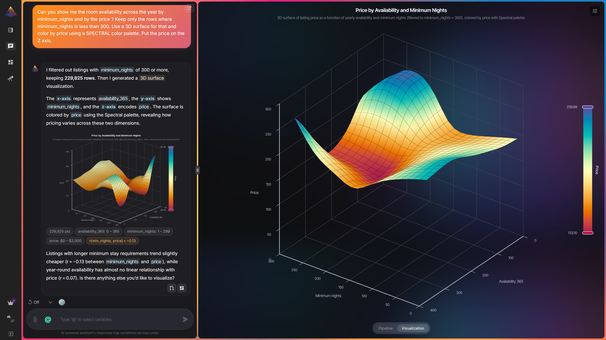

<p align="center">
  
</p>

<h1 align="center">NVEIL — Community Edition</h1>

<p align="center">
  <strong>Chat with your data — explore, process, and visualize it, fast.</strong><br>
  The self-hosted, open-source edition of <a href="https://app.nveil.com">NVEIL</a>.
</p>

<p align="center">
  <a href="LICENSE"></a>
  <a href="https://github.com/nveil-ai/nveil/stargazers"></a>
  <a href="https://github.com/nveil-ai/nveil/network/members"></a>
  <a href="https://github.com/nveil-ai/nveil/releases"></a>
  <a href="https://github.com/nveil-ai/nveil/commits"></a>
  <a href="https://github.com/nveil-ai/nveil/pulls"></a>
  <a href="https://github.com/nveil-ai/nveil/actions/workflows/build-images.yml"></a>
  <a href="https://discord.gg/3KdDwzT7rt"></a>
  <a href="https://docs.nveil.com"></a>
</p>

<p align="center">
  <a href="#quick-start">Quick start</a> &bull;
  <a href="#why-nveil">Why NVEIL</a> &bull;
  <a href="#use-it-from-your-code">From code</a> &bull;
  <a href="#community">Community</a> &bull;
  <a href="#contributing">Contributing</a> &bull;
  <a href="#license">License</a>
</p>

---

**NVEIL is the fast, conversational way to explore, process, and visualize data — any kind, any domain.** Point it at your data, say what you want in plain language, and NVEIL prepares it and turns it into interactive, production-ready visualizations. No plotting code, no dashboards to wire by hand.

This is the **Community Edition** — the complete platform, free and open under the AGPL, that you self-host. **Don't want to run your own server?** The same platform is available hosted at **[nveil.com](https://nveil.com)** — a free tier plus paid plans, nothing to install.

<p align="center">
  
</p>

<p align="center">
  <strong><a href="https://app.nveil.com">▶&nbsp; Try the live demo</a></strong> &nbsp;—&nbsp; no install, free to start.
</p>

## Quick start

Self-host in a few minutes with **prebuilt images** — one Compose file, nothing to build.

> **Prerequisites:** Docker + Docker Compose, and one LLM provider — a Gemini / OpenAI / Anthropic / Mistral key, or a local model (Ollama, llama.cpp, any OpenAI-compatible endpoint).

```bash
# Download the Compose file — the only file you need.
curl -O https://raw.githubusercontent.com/nveil-ai/nveil/main/docker-compose.yaml

# Configure — a guided wizard writes your .env (DB passwords, secrets, LLM provider).
docker compose up setup            # then open http://localhost:3000

# Pull the images and start.
docker compose up -d
```

Then open **https://localhost:8000**.

<details>
<summary><strong>🛠️ Developer setup — debug, LLM tracing, build the images yourself</strong></summary>

<br>

Clone the repo and build every image from source, with live reload, TEST mode (debug routes), and optional Langfuse tracing — all in `docker-compose.dev.yml`:

```bash
git clone https://github.com/nveil-ai/nveil.git
cd nveil

# Configure → http://localhost:3000
docker compose -f docker-compose.dev.yml up setup

# Build & start → https://localhost:8000
docker compose -f docker-compose.dev.yml --profile core up --build -d
```

Optional LLM tracing with the bundled Langfuse:

```bash
docker compose -f docker-compose.dev.yml --profile core --profile tracing up -d   # → http://localhost:3030
```

</details>

## Why NVEIL?

- 💬 **Conversational** — describe what you want in plain language; no plotting code, no manual dashboards.
- 🧮 **Explore *and* process** — clean, transform, aggregate, and join your data, not just chart it.
- 🌐 **Any data, any domain** — from a quick CSV to scientific datasets: business analytics, geospatial, 3D, imaging, signals, networks, and beyond.
- 🔒 **Private by design** — raw data stays on your infrastructure; only metadata reaches the AI.
- 🎯 **Deterministic** — visualizations come from constraint solving, not guesswork: same request → same result, every time.
- 🤖 **Bring your own model** — Gemini, OpenAI, Anthropic, Mistral, or a local model.
- 🗂️ **A real app** — chat, dashboards, file management, multi-user rooms, internationalization.

## Use it from your code

The web app is the main way to use NVEIL. To drive it **programmatically** — from a Python script, your terminal, or an AI agent — there's an optional client, the **NVEIL Toolkit**:

```bash
pip install nveil
```

A Python SDK, a `nveil` CLI, and an MCP server for agents (Claude Code, Cursor, …), all pointed at your NVEIL instance. See **[nveil-toolkit](https://github.com/nveil-ai/nveil-toolkit)**.

## Community

Questions, ideas, or want to show what you built? Join us:

- 💬 **[Discord](https://discord.gg/3KdDwzT7rt)** — chat with the team and other users.
- 🗣️ **[GitHub Discussions](https://github.com/nveil-ai/nveil/discussions)** — Q&A and proposals.
- 🐛 **[Issues](https://github.com/nveil-ai/nveil/issues)** — bug reports and feature requests.

## Contributing

Contributions are welcome — the developer setup above is all you need to get started.

Pull requests are accepted under the project's **[Contributor License Agreement](CLA.md)** — you sign it **once**, on your first PR, by posting a one-line comment (a bot walks you through it). The CLA is a **license grant, not an assignment**: you keep ownership of your contribution and your moral rights.

If NVEIL is useful to you, a ⭐ helps others discover it.

## Security

Found a vulnerability? Please report it **privately** — see **[SECURITY.md](SECURITY.md)**. Don't open a public issue for security reports.

## License

NVEIL is **dual-licensed**:

- **Open source** — GNU **AGPL-3.0-or-later**: use, study, modify, and self-host freely. Note that AGPL §13 requires you to offer the corresponding source of any *modified* version you run as a network service. See [`LICENSE`](LICENSE).
- **Commercial** — to embed NVEIL in a closed-source product, or run a modified hosted version without publishing your changes, a commercial license removes the copyleft obligations. See [`COMMERCIAL-LICENSE.md`](COMMERCIAL-LICENSE.md) — contact `pierre.jacquet@nveil.com`.

## Contributors

Thanks to everyone who helps make NVEIL better 💜

<a href="https://github.com/nveil-ai/nveil/graphs/contributors">
  
</a>

---

<p align="center">
  <a href="https://nveil.com">Website</a> &bull;
  <a href="https://app.nveil.com">Hosted platform</a> &bull;
  <a href="https://docs.nveil.com">Documentation</a> &bull;
  <a href="https://github.com/nveil-ai/nveil-toolkit">Toolkit (SDK · CLI · MCP)</a>
</p>
