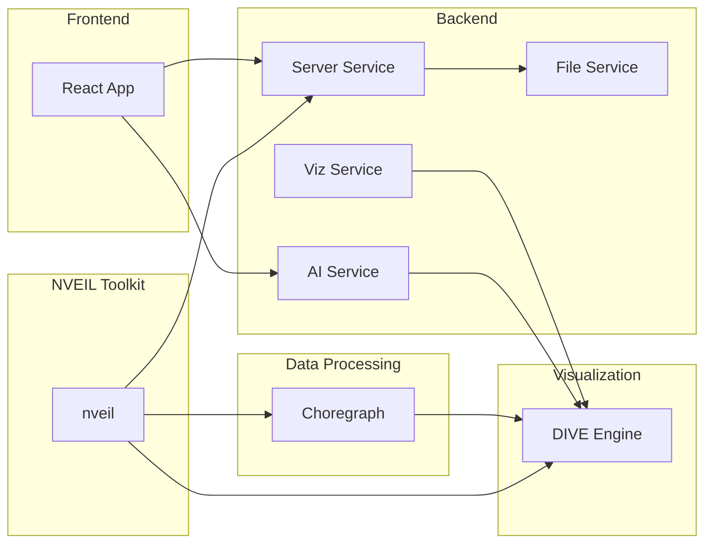

**Scientific data visualization and analysis platform**

NVEIL is a modular platform combining a visualization engine, data processing pipelines, and intelligent backend services. Select a component below to browse its documentation.

---

-   :material-code-braces:{ .lg .middle } **NVEIL Toolkit**

    ---

    Generate visualization specs from data and natural-language prompts. Privacy-first: raw data never leaves your machine. Ships with a Python library, CLI, MCP server, and Claude skill.

    [:octicons-arrow-right-24: Toolkit Documentation](./sdk/)

-   :material-eye:{ .lg .middle } **DIVE**

    ---

    Pure Python visualization engine — Pydantic models, XML specifications, ASP constraint solver, and multi-backend rendering (Plotly, VTK, DeckGL).

    [:octicons-arrow-right-24: DIVE Documentation](./dive/)

-   :material-graph:{ .lg .middle } **Choregraph**

    ---

    Graph-based data processing library — Kedro pipelines, 50 built-in transforms, geolocation, NLP, and Excel intelligence.

    [:octicons-arrow-right-24: Choregraph Documentation](./choregraph/)

-   :material-server-network:{ .lg .middle } **Backend Services**

    ---

    Microservices backend — Server (auth, rooms, dashboards), AI (LLM workflows, ASP), File (CRUD, workspaces), and Viz (Trame rendering).

    [:octicons-arrow-right-24: Backend Documentation](./backend/)

-   :material-react:{ .lg .middle } **Frontend**

    ---

    React 18 application — real-time AI chat, multi-backend visualization, dashboards, file management, and internationalization.

    [:octicons-arrow-right-24: Frontend Documentation](./frontend/)

---

## Architecture

## Components

| Component | Description | Status |
|-----------|-------------|--------|
| [**NVEIL Toolkit**](./sdk/) | Privacy-first data visualization toolkit — Python library, CLI, MCP server, Claude skill | Documented |
| [**DIVE**](./dive/) | Visualization engine — models, XML, ASP solver, rendering | Documented |
| [**Choregraph**](./choregraph/) | Data processing — Kedro pipelines, transforms, connectors | Documented |
| [**Backend Services**](./backend/) | Server, AI, File, Viz — FastAPI microservices | Documented |
| [**Frontend**](./frontend/) | React/Vite web application | Documented |
