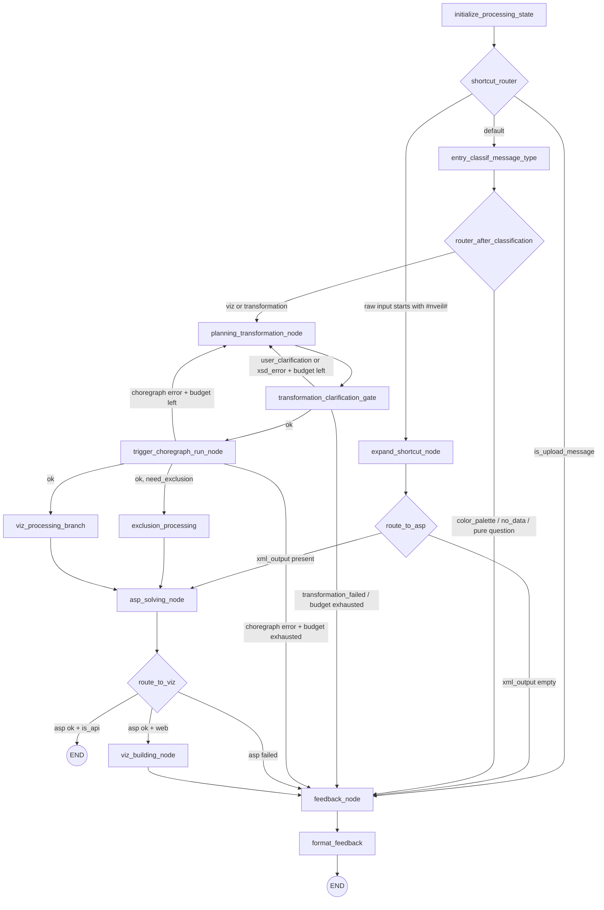
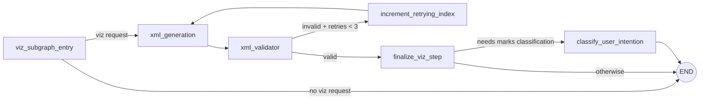

# AI Service

FastAPI service (port **8100**) responsible for turning a user message into a
fully-solved VisuSpec visualization. It orchestrates a LangGraph state machine
that calls an LLM (any of six supported providers), runs the Choregraph data
pipeline, and finally solves a constraint program through the DIVE ASP solver.

The same graph powers both the interactive web flow (community docker-compose
or hosted deployments) and the public SDK — only the entry point and a single
`is_api` flag differ.

---

## Table of contents

1. [Entry points](#entry-points)
2. [LangGraph architecture](#langgraph-architecture)
3. [Choregraph + ASP pipeline](#choregraph--asp-pipeline)
4. [Retry strategy](#retry-strategy)
5. [Plugging in your own LLM](#plugging-in-your-own-llm)
6. [Per-node configuration (yaml)](#per-node-configuration-yaml)
7. [Checkpointing & human-in-the-loop interrupts](#checkpointing--human-in-the-loop-interrupts)
8. [HTTP routes](#http-routes)
9. [Observability](#observability)
10. [Local development](#local-development)

---

## Entry points

| File | Purpose |
|------|---------|
| `ai_server.py` | FastAPI app + lifespan (LLM manager, checkpointer, HTTP client, state DB). |
| `llm_processing/graphs/workflow_request.py` | `UserRequest` — the unified LangGraph state machine. |
| `llm_processing/graphs/workflow_request_nodes.py` | LLM-calling nodes (classification, planning, XML, exclusion). |
| `llm_processing/graphs/workflow_postprocess_nodes.py` | ASP solving, viz rendering, feedback, HTML formatting. |
| `llm_processing/managers/` | Provider-routed LLM managers (`base.py`, `router.py`, `gemini.py`, `generic.py`). |
| `llm_processing/configs/<provider>.yaml` | Per-provider, per-node kwargs (model, temperature, thinking…). |
| `llm_processing/checkpointer.py` | PostgreSQL `AsyncPostgresSaver` for LangGraph state persistence. |
| `shared/llm_config.py` | `LLMConfig` dataclass + `build_chat_model` factory. |

The service exposes a single high-level chat endpoint (`POST /ai/process_user_message`) and a polymorphic SDK endpoint (`POST /ai/sdk/process`). See the [HTTP routes](#http-routes) section below.

---

## LangGraph architecture

`UserRequest` (in `workflow_request.py`) is a `StateGraph[WorkflowState]`
compiled with a PostgreSQL checkpointer. The state schema lives in
`workflow_state.py` and is divided into four buckets:

| Key | Owner |
|-----|-------|
| `input` | Immutable request payload (user message, ids, language, cookies, `is_api`, …). |
| `processing` | All intermediate values written by nodes (lists of steps, ASP facts, XML output, feedback material, retry counters, error markers, …). |
| `output` | Final response to the client (`text`, `suggestions`, optional `selection_prompt`). |
| `turn_metrics` | Token counts, latency and cost per LLM call (see `turn_metrics.py`). |

### Top-level graph



### Key nodes

| Node | Type | Role |
|------|------|------|
| `initialize_processing_state` | sync | Hydrate `state.processing` from input + previous `specifications.xml`. |
| `expand_shortcut_node` | sync | Resolve `#nveil#…` shortcut into a ready-to-solve XML payload. |
| `entry_classif_message_type` | LLM | Classifies the message (viz request / question / additional info / exclusion / color palette / transformation) and probes data availability. |
| `planning_transformation_node` | LLM | Single LLM call. Produces a Choregraph transformation XML (validated against XSD), a textual plan, or asks for clarification via `early_exit`. |
| `transformation_clarification_gate` | interrupt | Pauses the graph if the LLM requested clarification; resumes when the frontend sends the user's reply. |
| `trigger_choregraph_run_node` | I/O | Web: HTTP POST `/viz/run_choregraph`. SDK: `interrupt()` so the client runs choregraph locally. |
| `viz_processing_branch` | subgraph | XML generation → XSD validation (retry loop) → optional mark-keyword classification. |
| `exclusion_processing` | LLM | Translates exclusion phrases ("exclude France from 2024") into ASP facts. |
| `asp_solving_node` | DIVE | `defer=True` — waits for both parallel predecessors, then runs Clingo through `dive.asp.ASPSolver`. |
| `viz_building_node` | I/O | Web-only: POST `/viz/send` on the server proxy to render the visualization. |
| `feedback_node` | LLM | Generates the natural-language feedback for the user, plus optional color-palette config or selection prompt. |
| `format_feedback` | sync | Assembles the final HTTP response (markdown → HTML, viz thumbnail, suggestion buttons). |

### Parallel fan-out

After `trigger_choregraph_run_node`, the graph fans out to
`viz_processing_branch` and (when needed) `exclusion_processing` in parallel.
The two branches converge on `asp_solving_node`, which is declared with
`defer=True`. LangGraph guarantees the deferred node only fires once every
scheduled predecessor has completed — this replaces the previous explicit
`merge_parallel_results` barrier.

### Viz subgraph



The XML validator parses the LLM output against the VisuSpec XSD
(`viz_file_utils/utils/viz_spec_validator.py`). On failure the loop increments
a counter and re-prompts the LLM with the errors. Bound: **3 retries** (constant
in `should_retry`).

---

## Choregraph + ASP pipeline

The "intelligence" of the service is split across three layers:

1. **Choregraph XML** — declarative ETL describing how raw datasets are tidied
   into the analysis-ready table. Generated by `planning_transformation_node`,
   validated against `Choregraph().get_xsd()`, executed either by the server
   (`/viz/run_choregraph`) or by the SDK on the user's machine.
2. **VisuSpec XML** — the visualization grammar (marks, channels, encodings).
   Generated by `xml_generation` and validated against `XSD_FILEPATH`.
3. **ASP constraints** — the spec is augmented with dynamic facts
   (`concept(bar)`, exclusions, …) and handed to Clingo through
   `dive.asp.ASPSolver`. The solver returns a fully-resolved
   `specifications.xml` that the viz layer can render directly.

`enhance_specifications_xml` (in `workflow_postprocess_nodes.py`) is the
integration point: it merges the LLM output into the existing XML, takes a
backup (`specificationsBeforeAI.xml`), runs ASP, and restores the backup if
the call raises. ASP execution is hard-bounded at **60 seconds** via
`asyncio.wait_for`; a timeout is surfaced to the user as a "logic too
complex" message rather than failing the request.

Dynamic ASP facts come from two sources:
- `classify_user_intention` — adaptive-threshold keyword classification that
  injects `concept(<mark>)` facts based on the user's vocabulary.
- `exclusion_processing` — turns exclusion phrases into selector/value/scope
  facts via `ExclusionFactBuilder`.

---

## Retry strategy

There are **three independent retry budgets** in the service. Knowing which
fires when matters for debugging cost spikes and stuck conversations.

### 1. Structured-output retries (LLM manager)

Location: `llm_processing/managers/generic.py` → `_ainvoke_structured`.

Every LLM call that requests a Pydantic schema runs this loop:

- 2 structured-output methods are tried in order: `json_schema` first
  (decoder-enforced, best quality on most providers), `function_calling` as
  a universal fallback (covers union/optional schemas and providers whose
  `json_schema` support is flaky — OpenRouter, quantized models, …).
- Up to **3 attempts** × 2 methods = **worst case 6 LLM calls**.
- `_is_non_retryable_error` short-circuits the loop on auth (`401`, `403`,
  `permission_denied`, …) and unknown-model errors (`404`, `model_not_found`):
  same key/model, both methods will fail identically.
- LangChain itself wraps each call with `max_retries=2` (network-level
  transient failures). Set in `build_chat_model`.

### 2. Viz XML validation retries (subgraph)

Location: `workflow_request.py` → `should_retry` (constant `max_retries = 3`).

After `xml_validator` reports XSD errors, the viz subgraph cycles back to
`xml_generation` with the validation errors injected into the prompt. Cap: **3
retries**, after which the graph proceeds with the best invalid XML and lets
the ASP/feedback nodes surface a graceful error.

### 3. Planning + Choregraph retry budget

Location: `workflow_request.py` → `MAX_PLANNING_RETRIES = 3`.

A **single counter** (`planning_retries`) covers every automatic retry of
`planning_transformation_node`, whether triggered by:

- XSD validation failure on the generated `choregraph.xml`, or
- runtime failure of the Choregraph execution (HTTP error from `/viz/run_choregraph`).

Each LLM call through the node consumes one budget slot. The cycle-back is
always a *fresh* LLM call — the same XML is never retried. Once the budget is
exhausted, the graph forwards to `feedback_node`, which surfaces the last error
to the user.

**Human-driven clarifications are bounded separately** by
`consecutive_clarifications` (cap 2). A clarification reply does **not**
consume the planning budget.

### Quick reference

| Source of retries | Cap | Where |
|-------------------|-----|-------|
| LangChain network retries | 2 | `build_chat_model(max_retries=2)` |
| Structured output (method × attempt) | 3 × 2 | `LangChainLLMManager._ainvoke_structured` |
| Viz XML validation | 3 | `should_retry` |
| Planning / choregraph | 3 | `MAX_PLANNING_RETRIES` |
| Consecutive clarifications | 2 | `consecutive_clarifications` |
| ASP solving timeout | 60 s | `asp_solving_node` |
| Choregraph HTTP timeout | 120 s | `trigger_choregraph_run_node` |

---

## Plugging in your own LLM

The service supports **six providers** out of the box:

`google_genai`, `openai`, `anthropic`, `mistralai`, `ollama`, `llamacpp`

### Provider abstraction

Two layers:

1. **`shared/llm_config.LLMConfig`** — an immutable per-request dataclass:
   `(provider, api_key, base_url?, model_override?)`. Carried through
   LangGraph nodes via `RunnableConfig.configurable["llm_config"]`.
2. **Manager hierarchy** in `llm_processing/managers/`:
   - `LLMManager` (abstract) → `LangChainLLMManager` (default for every
     provider via `langchain.init_chat_model`) → `GeminiLLMManager` (override
     for Google's context-cache feature).
   - `RouterLLMManager` is the single instance held by the FastAPI app; it
     dispatches each call to the right manager based on
     `llm_config.provider`.

### How a request picks a provider

There is **one** provider for the whole service, chosen at startup — clients
(SDK or web) cannot select or override it. The lifespan walks
`PROVIDER_BOOT_ORDER` (`google_genai`, `openai`, `anthropic`, `mistralai`,
`ollama`, `llamacpp`) and keeps the **first one** that:

- has a usable env-level config (matching `<PROVIDER>_API_KEY` set, or
  `<PROVIDER>_BASE_URL` + `<PROVIDER>_MODEL` for locals), and
- passes a one-token smoke-test against its endpoint.

There is **no NVEIL fallback** — if no provider in the order passes, the
service refuses to start. Operators configure keys through the setup, which
writes them to `docker-compose.yaml` + `.env`. Every request then resolves
its config through `ai_server.get_llm_config()`, which returns this single
boot-selected provider.

### Adding a brand new provider

Most cases are covered by `LangChainLLMManager` — the only requirement is that
the provider be supported by `langchain.init_chat_model`. To add one:

1. Add the provider literal to `LLMProvider` in `shared/llm_config.py`.
2. Add an entry to `_PROVIDER_ENV_KEY` (env var that holds the key) and, if
   the LangChain `model_provider` string differs from the name (e.g. an
   OpenAI-compatible endpoint), add an entry to `_LANGCHAIN_PROVIDER`.
3. If the provider has no auth (local), add it to
   `LOCAL_PROVIDERS_WITHOUT_KEY`.
4. Create `llm_processing/configs/<provider>.yaml` with `defaults` + per-node
   overrides in the provider's **native** kwarg syntax (no abstraction).
5. Add a validation model to `_VALIDATION_MODELS` and a timeout to
   `_VALIDATION_TIMEOUTS` in `ai_server.py` so the boot smoke-test can
   verify it.
6. (Optional) Subclass `LangChainLLMManager` and register it in
   `RouterLLMManager.PROVIDER_OVERRIDES` if the provider needs special
   handling (caching, custom rate-limiting, …).

The per-request `LLMConfig` is keyed into a pool keyed on
`(provider, model, base_url, sha256(api_key)[:12], frozen_kwargs)` so users
stay isolated and quantized-model swaps don't reuse a stale `BaseChatModel`.

### Local models (Ollama / llama.cpp)

Both are wired through LangChain's `openai` client against an
OpenAI-compatible local endpoint:

- **Ollama** — the operator must set `OLLAMA_MODEL` in `.env` (the Ollama tag,
  e.g. `qwen3:27b`). `extra_body.think: false` and `options.num_ctx: 16384` are
  set in `ollama.yaml` to avoid the default 2048-token context window
  silently truncating the XSD-heavy prompts.
- **llama.cpp** — model and context window are fixed at `llama-server`
  startup; the yaml's `model` value must match the `--alias` flag (or any
  string when no alias is set).

Cold-load timeouts: Ollama's first request can take **30–60 s** to load a
multi-GB model into VRAM. The boot smoke-test uses a **120 s** budget for
Ollama specifically.

---

## Per-node configuration (yaml)

Every provider yaml has the same node names but values in **provider-native**
syntax — there is no abstraction layer. `node_config.get_node_config()` merges
`defaults` + (optional inherited profile) + per-node overrides (with `null`
removing a key from the defaults).

A top-level `minimal:` block defines the provider's smallest/cheapest model —
the single source of truth shared with choregraph CSV characterization and the
setup wizard's "test connection" ping (`node_config.get_minimal_config()`). A
node opts into it with `inherits: minimal`, layering the profile between
`defaults` and its own overrides.

```yaml
# google_genai.yaml — excerpt
defaults:
  model: gemini-3-flash-preview
  temperature: 0.3
  thinking_level: low
  include_thoughts: true

minimal:                   # cheap model, shared with choregraph + setup ping
  model: gemini-3-flash-preview
  thinking_level: low
  include_thoughts: false

nodes:
  entry_classification:
    temperature: 0
    thinking_level: low
  csv_characterization:
    inherits: minimal      # model/kwargs come from the `minimal:` block
    temperature: 0
```

Node names referenced by the workflow:

`entry_classification`, `exclusion_processing`, `xml_generation`,
`keyword_classification`, `planning_transformation`, `feedback`,
`csv_characterization`.

Each LLM-calling node resolves its kwargs with:

```python
llm_cfg, node_cfg = get_call_config("xml_generation", config)
response = await self.llm_manager.ainvoke(
    chat_template=chat_template,
    variables=variables,
    llm_config=llm_cfg,
    response_schema=...,
    cache_name="xml_generation",   # only honored by GeminiLLMManager
    cost_label="XML Generation Node",
    **node_cfg,
)
```

`cache_name` is a hint — providers without context-cache support
(`supports_context_cache=False`) silently ignore it.

---

## Checkpointing & human-in-the-loop interrupts

The graph is compiled with a PostgreSQL `AsyncPostgresSaver`
(`llm_processing/checkpointer.py`), backed by an `AsyncConnectionPool`
(autocommit on — needed for `CREATE INDEX CONCURRENTLY` during `setup()`).

- **Thread id** — web flow: `room_id`. SDK flow: `api-<uuid>` generated by
  `/ai/sdk/process` on the first call.
- **Lifecycle** — `chat_endpoint` checks for a pending interrupt before each
  call: if one exists and the user submitted a clarification reply
  (`is_selection=True`), it `aresume`s; otherwise it clears the checkpoint
  and `arun`s fresh. On normal completion the checkpoint is cleared via
  `clear_thread(room_id)`.
- **Startup cleanup** — `_cleanup_stale_api_sessions` wipes orphaned
  `api-*` checkpoints and workspaces from the previous process (SDK sessions
  cannot survive a restart anyway).

### Interrupts

Two places call `langgraph.types.interrupt()`:

| Node | When | Resume payload |
|------|------|-----------------|
| `transformation_clarification_gate` | LLM returned `early_exit=true` and the consecutive clarification cap (2) hasn't been hit | The user's reply text |
| `trigger_choregraph_run_node` | `is_api=True` — the SDK must run choregraph locally | `{"reason": "sdk_processing_complete"}` |

The clarification interrupt is bypassed when `is_api=True` (single-shot SDK
generation) or when the consecutive cap has been hit. `_extract_interrupt_data`
in `ai_server.py` turns the pending value into the JSON the frontend expects
(`{text, selection_prompt}`).

---

## HTTP routes

| Method | Path | Purpose |
|--------|------|---------|
| GET | `/ai/health` | Health check. |
| POST | `/ai/process_user_message` | Main chat endpoint (web). |
| POST | `/ai/characterize_csv` | LLM-based fallback when heuristic CSV characterization fails. |
| POST | `/ai/preprocess_excel` | Detect tables in an Excel sheet and write companion parquets. |
| GET | `/ai/user/settings` | Get the user's AI preferences (tone, additional info). |
| POST | `/ai/user/settings` | Update the user's AI preferences. |
| POST | `/ai/sdk/process` | Polymorphic SDK endpoint (fresh vs resume on `session_id`). |

### `POST /ai/process_user_message`

Request:

```json
{
  "message": "Show revenue per region as bars",
  "user_id": "uuid",
  "room_id": "uuid",
  "owner_id": "uuid",
  "room_token": "string",
  "user_language": "en",
  "is_upload": false,
  "is_selection": false,
  "message_history": [ ... ]
}
```

Response (normal completion):

```json
{
  "text": "<html feedback>",
  "suggestions": [ {"text": "...", "type": "color_palette", "config": {...}} ],
  "selection_prompt": null
}
```

Response (interrupt pending — clarification needed):

```json
{
  "text": "<feedback explaining the ambiguity>",
  "suggestions": [],
  "selection_prompt": { "prompt_id": "...", "prompt": "...", "options": [...] }
}
```

### `POST /ai/sdk/process` — two-phase contract

**Fresh** (no `session_id`):

```json
{
  "prompt": "Build a chart of users by country",
  "choregraph_xml": "<choregraph>...</choregraph>",
  "catalogue_stats": "<json>",
  "owner_id": "string"
}
```

Returns (graph paused at choregraph trigger):

```json
{
  "status": "awaiting_choregraph",
  "session_id": "api-<uuid>",
  "choregraph_xml": "<updated choregraph>",
  "visualization_plan": "..."
}
```

**Resume** (with `session_id`):

```json
{
  "session_id": "api-<uuid>",
  "owner_id": "...",
  "choregraph_xml": "<original>",
  "specifications_xml": "<seed spec>",
  "catalogue_stats": "<json>"
}
```

Returns (graph completed):

```json
{
  "status": "complete",
  "session_id": "api-<uuid>",
  "visuspec_xml": "<final spec>",
  "explanation": "Visualization generated",
  "warnings": []
}
```

The session workspace + checkpoint are cleaned up after a `complete` or
errored response. Raw user data **never** leaves the client: only the
catalogue stats and the generated XMLs are shipped.

---

## Observability

### Per-turn metrics

`TurnMetrics` (`turn_metrics.py`) records every LLM call's tokens (`input`,
`output`, `cached`), latency and retry count. Each node sets the `cost_label`
it wants surfaced; the table is rendered at the end of each turn in the
service logs.

### Error logs

`debug_errors.log_visuspec_error` / `log_choregraph_error` persist structured
error rows in PostgreSQL with the attempt index, room id and error type
(`syntax`, `xsd_validation`, `runtime`). Useful for retrospective debugging
across many sessions.

### Langfuse tracing (opt-in, self-hosted)

The service is wired for [Langfuse](https://langfuse.com) on two axes:

1. **Trace capture** — `_with_tracing()` (in `graphs/workflow.py`) attaches a
   fresh `CallbackHandler` per request so every chain run becomes its own
   trace root (no nesting across turns). `tag_current_trace([...])` is called
   at init, classification and feedback to surface the final set of steps the
   graph took (`visualization_request`, `transformation_feedback`,
   `additional_info`, `color_palette_request`, `no_data_guidance`, …).
2. **Prompt management** — every concrete `Prompt` subclass (see
   `llm_processing/prompt.py`) carries a `LANGFUSE_NAME`. At build time the
   prompt is fetched from Langfuse at label `LANGFUSE_PROMPT_LABEL` (default
   `latest`); if Langfuse is unreachable or doesn't have a version, the
   service falls back to `prompt_templates.yaml` shipped in the repo and
   continues silently. The Langfuse prompt object is attached as
   `metadata={"langfuse_prompt": p}` on the resulting `ChatPromptTemplate`
   so generations are linked to the prompt version.

#### Enabling tracing on the community stack

The full Langfuse stack (`langfuse-web`, `langfuse-worker`, plus dedicated
postgres, clickhouse, redis and minio) lives in the **same `docker-compose.yaml`**
as the app, under the `tracing` profile (the app services are under `core`).
Starting it with a separate project name groups it apart from the NVEIL
services in Docker Desktop — one file, two projects. **Off by default** so the
`core` stack doesn't pay the ~2–3 GB RAM cost.

Two steps:

1. Set Langfuse keys in `.env` (re-run the setup wizard's *LLM TRACING*
   section or edit by hand):
   ```env
   LANGFUSE_TRACING=1
   LANGFUSE_PUBLIC_KEY=pk-lf-<your-key>
   LANGFUSE_SECRET_KEY=sk-lf-<your-key>
   ```
   The keys are seeded into the local Langfuse project on first start, so any
   value works — they're identifiers shared between the AI service and the
   Langfuse instance, not real credentials.

2. Start Langfuse as its own project:
   ```bash
   docker compose -p langfuse --profile tracing up -d
   ```
   Because every service is profiled, this never starts the `core` app services
   (and vice-versa). The `ai` container reaches Langfuse across projects via
   `host.docker.internal:3030` (the published port) — no shared docker network
   needed.

UI: <http://localhost:3030> · login `dev@nveil.com` / `dev-password`.

#### Seeding prompts into local Langfuse

`prompt_templates.yaml` is the canonical source — Langfuse is secondary. To
browse / edit prompts via the Langfuse UI, push them once:

```bash
docker compose exec ai python /scripts/seed_langfuse_prompts.py
```

This creates a `latest`-labelled version of every chat prompt
(`entrypoint_classification`, `xml_generation`, `feedback`, …) and every
shared text fragment (`shared/{category}/{key}`). Subsequent runs bump
versions; previous ones are preserved.

Two yaml sections are intentionally **not** pushed to Langfuse because they
are consumed directly by Python helpers and never reach the LLM:

- `_xml_mapping_rules`
- `question_answering`

#### Persisting UI edits back to yaml

A prompt edited in the Langfuse UI exists only inside the local Langfuse
database. It is lost on a `down -v` of the langfuse project and does not
propagate to other deployments. To make a UI edit canonical, snapshot
Langfuse back into the yaml via the host-side Makefile target:

```bash
# One-time host install
pip install langfuse pyyaml

# Pull every prompt at the chosen label into prompt_templates.yaml
make ai-prompts-release-snapshot                 # LABEL=production (default)
make ai-prompts-release-snapshot LABEL=staging   # …or any other label
```

The script (`nveil-community/scripts/export_prompts_to_yaml.py`) preserves
the yaml-only sections listed above and warns on stderr for any prompt that
has no version at the requested label. Commit the resulting diff to ship
the edit.

#### Label conventions

| Label | Default in | Intended role |
|-------|------------|---------------|
| `latest` | `LANGFUSE_PROMPT_LABEL` runtime · `seed_langfuse_prompts.py` | Dev iteration — bumped on every seed. |
| `production` | `make ai-prompts-release-snapshot` | Stable snapshot meant to be committed to yaml. |

Suggested flow: iterate on `latest`, promote a known-good version to
`production` from the Langfuse UI, then run the export Makefile target.

#### Fallback behavior

The Langfuse SDK is **entirely bypassed** when `LANGFUSE_TRACING` is empty —
no client construction, no OTEL exporter, no log noise. When
`LANGFUSE_TRACING=1` but the Langfuse stack isn't running, the SDK still
loads but every fetch fails with a logged warning; the workflow continues
because the yaml fallback always succeeds.

#### Env vars

| Var | Default | Effect |
|-----|---------|--------|
| `LANGFUSE_TRACING` | empty | Master gate. Empty = SDK never loaded. `1`/`true`/`yes`/`on` enables. |
| `LANGFUSE_HOST` | `http://host.docker.internal:3030` | Langfuse server URL — default reaches the separate langfuse project via the host's published port. |
| `LANGFUSE_PUBLIC_KEY` | `pk-lf-community-dev` | Auth (seeded into the local project at first start). |
| `LANGFUSE_SECRET_KEY` | `sk-lf-community-dev` | Auth (seeded into the local project at first start). |
| `LANGFUSE_PROMPT_LABEL` | `latest` | Which label to fetch when looking up a prompt. |
| `LANGFUSE_PROMPT_CACHE_TTL` | `5` (when enabled) / `60` (fallback) | Seconds the SDK caches a fetched prompt. |

See [the community tracing guide](../../../docs/docs/tracing.md) for
troubleshooting, resource cost and disabling instructions.

---

## Local development

The service is run by the community docker-compose stack
(`nveil-community/docker-compose.yaml`). For the full open-source quick start
see `nveil-community/README.md` and `nveil-community/docs/docs/index.md`.

Required env vars:

| Var | Purpose |
|-----|---------|
| `LLM_PROVIDER` | Default provider (`google_genai`, `openai`, `anthropic`, `mistralai`, `ollama`, `llamacpp`). |
| `<PROVIDER>_API_KEY` | Matching API key. Skipped for local providers. |
| `LLM_BASE_URL` | Optional — for OpenAI-compatible proxies (OpenRouter, vLLM, …). |
| `STATE_DATABASE_URL` | PostgreSQL DSN for state + metrics. |
| `CHECKPOINT_DATABASE_URL` | PostgreSQL DSN for LangGraph checkpoints. Falls back to `STATE_DATABASE_URL` (minus `+asyncpg`). |
| `STATE_DATABASE_SCHEMA` | Schema name to create on startup. |
| `SERVER_HOST` | Server-service hostname (for `/viz/run_choregraph` and `/viz/send`). |
| `DIVE_PATH` | Root of per-owner workspaces (defaults to `/root/DIVE`). |
| `LOCAL` | When set, enables local-dev shortcuts. |

Langfuse tracing is opt-in; see [Observability → Langfuse tracing](#langfuse-tracing-opt-in-self-hosted).

The full graph topology can be regenerated as a Mermaid diagram from inside
the running ai container:

```bash
docker compose exec ai python3 /scripts/dump_ai_graph.py > ai-graph.mmd
```

Open the resulting file at <https://mermaid.live> or preview it in your IDE.

### Companion docs

Short reference pages under `nveil-community/nveil/backend/docs/ai/`:

- `index.md` — high-level overview.
- `workflows.md` — workflow-by-workflow summary.
- `llm-manager.md` — manager internals.
- `prompts.md` — prompt catalogue.
- `routes.md` — route table.

Community-facing user guides under `nveil-community/docs/docs/`:

- `index.md` — top-level project intro.
- `tracing.md` — Langfuse opt-in tracing guide.
