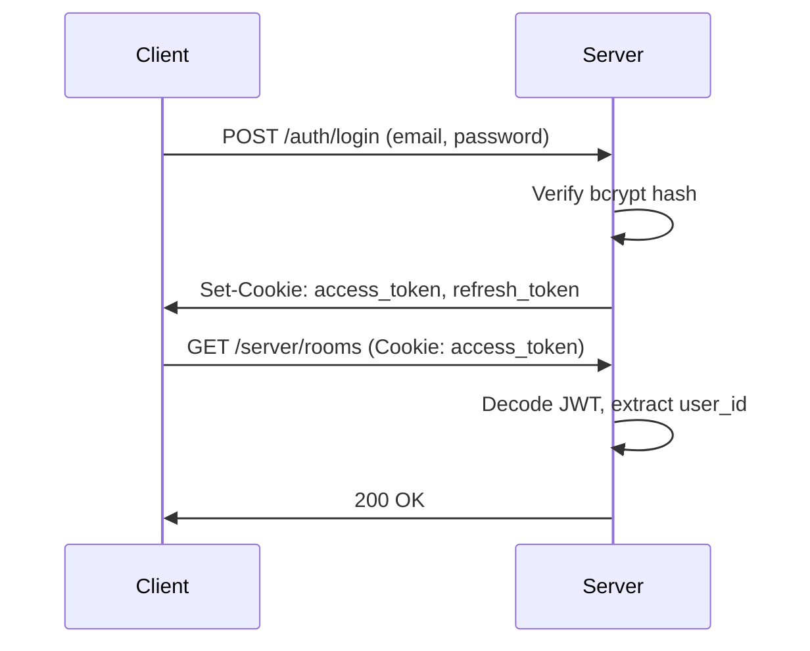

# Authentication

NVEIL uses a layered authentication system supporting JWT tokens, refresh tokens, OAuth2 providers, and API keys.

## JWT Access Tokens

Short-lived tokens (15 min default) issued on login. Carried as HTTP-only cookies.



## Refresh Tokens

Long-lived tokens (7 days default) stored in the `refresh_tokens` table. Used to obtain new access tokens without re-login.

```
POST /auth/refresh → new access_token + rotated refresh_token
```

## OAuth2

Supported providers:

- **Google** — OpenID Connect
- **GitHub** — OAuth2 Authorization Code

Flow: redirect to provider → callback with code → exchange for user info → create/link account → issue JWT.

## API Keys

For programmatic access (REST API). Hash-based validation:

1. `POST /api/v1/keys` → generates key, stores `key_hash` in DB, returns plaintext key once
2. Client sends `Authorization: Bearer <key>` header
3. Server hashes the key and looks up `api_keys.key_hash`

## Room Token Auth

Viz containers authenticate requests using a room-specific token stored in `rooms.token`. This token is passed as a cookie when the frontend connects to a viz WebSocket.

## Rate Limiting

Login attempts are throttled per IP via `rate_limiter.py` to prevent brute-force attacks.
