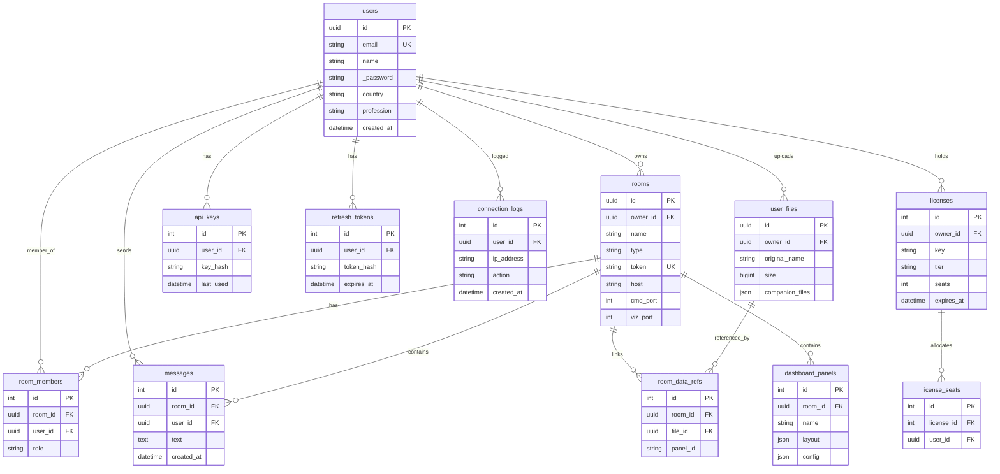

# Database Schema

All services share a single PostgreSQL instance. The server and file services use the main schema; the AI service uses a separate state schema.

## Server / File schema

## AI state schema

| Table | Columns | Purpose |
|-------|---------|---------|
| `turn_metrics_record` | id, room_id, user_id, turn_number, input_tokens, output_tokens, cached_tokens, latency_ms, classification, timestamp | Per-turn LLM metrics |
| `user_properties` | id, user_id, tone, additional_info | User preferences for AI responses |

## Migrations

Alembic manages schema migrations from `server_service/database/models/alembic/`. One migration system for the shared database — the file service does not run its own migrations.
