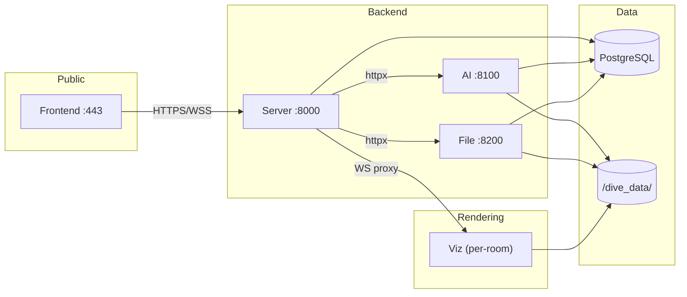

# Service Map

## Overview

## Service responsibilities

| Service | Port | Responsibility |
|---------|------|---------------|
| **Server** | 8000 | User auth, room lifecycle, dashboard CRUD, WebSocket hub, proxy to AI/File/Viz |
| **AI** | 8100 | LLM chat processing, intent classification, ASP solving, visualization spec generation |
| **File** | 8200 | File upload/delete, workspace symlinks, room data provisioning, choregraph building |
| **Viz** | dynamic | Per-room Trame app, interactive rendering (Plotly/VTK/DeckGL), Kedro Viz |

## Communication patterns

### Server → AI (synchronous HTTP)

The server proxies user chat messages to the AI service via `POST /ai/process_user_message`. The AI service runs a LangGraph workflow and returns the result synchronously.

### Server → File (synchronous HTTP)

File uploads arrive at the server (`POST /server/data/upload`) and are proxied to the file service. Link/unlink operations are also proxied.

### Server → Viz (WebSocket proxy)

The server maintains a WebSocket connection to each active viz container. Client Trame messages are forwarded transparently via `/viz/app/ws`.

### Viz → Server (HTTP callback)

Viz containers notify the server of status changes (ready, error, shutdown) via `POST /server/notifications`.

## Room pool

Viz containers are managed by the room pool:

- **Local (Docker)**: `docker_pool_manager.py` spawns containers via Docker API
- **Staging/Production (K8s)**: `pool_manager.py` creates pods in the `viz-service` namespace

Each room gets a dedicated container with its own port allocation.
