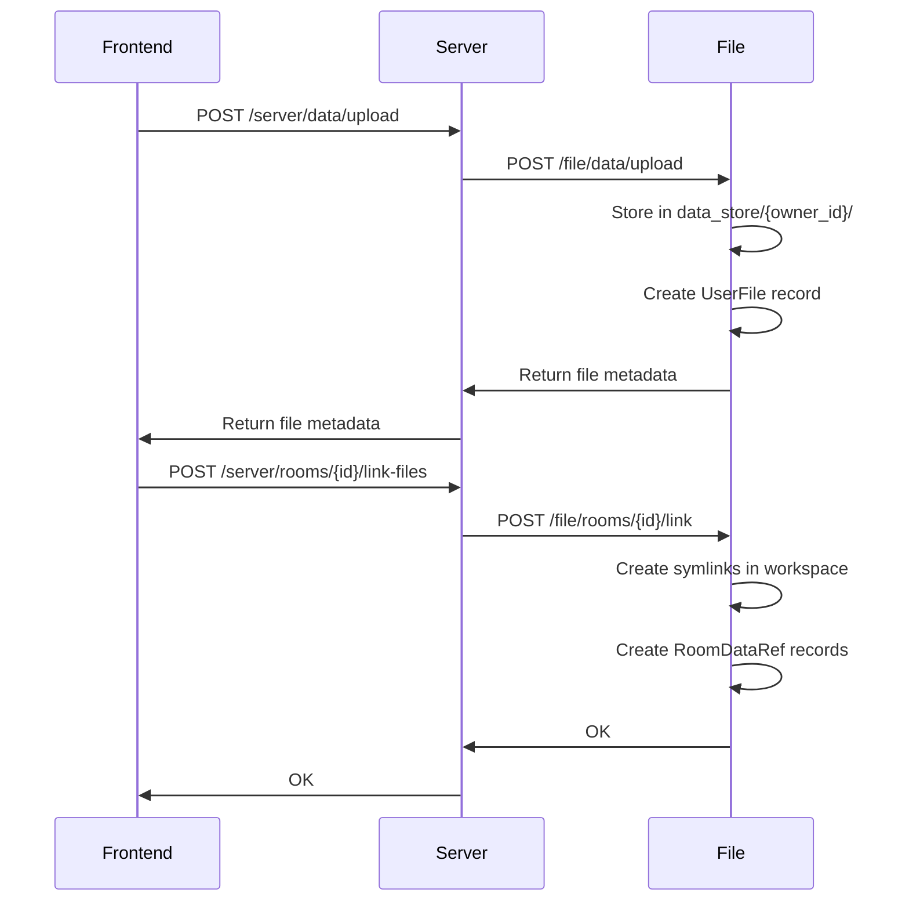

# File Routes

## Data CRUD (`/file/data/`)

| Method | Path | Description |
|--------|------|-------------|
| GET | `/file/data/list/{owner_id}` | List user's files with room references |
| POST | `/file/data/upload` | Upload file (multipart, handles companions) |
| DELETE | `/file/data/{file_id}` | Delete file from data store |
| POST | `/file/data/{file_id}/reupload` | Replace file, notify linked rooms |

## Room Workspace (`/file/rooms/`)

| Method | Path | Description |
|--------|------|-------------|
| POST | `/file/rooms/{room_id}/link` | Create symlinks in room workspace |
| POST | `/file/rooms/{room_id}/apply` | Write spec XML, apply metadata, build choregraph |
| DELETE | `/file/rooms/{room_id}/unlink/{file_id}` | Remove symlink from workspace |
| POST | `/file/rooms/{room_id}/provision-panel` | Provision dashboard panel workspace |
| DELETE | `/file/rooms/{room_id}/panels/{panel_id}` | Clean up panel references |

## Upload flow

