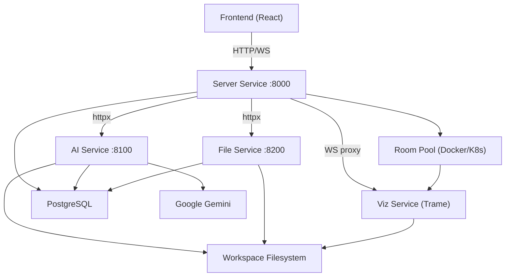

# NVEIL Backend

**Microservices backend for the NVEIL visualization platform**

The NVEIL backend is composed of four FastAPI services sharing a PostgreSQL database and a centralized workspace filesystem.

---

## Services

-   :material-server:{ .lg .middle } **Server Service** — Port 8000

    ---

    Core orchestration: user accounts, rooms, dashboards, WebSocket events, and proxy to other services.

    [:octicons-arrow-right-24: Server docs](server/)

-   :material-brain:{ .lg .middle } **AI Service** — Port 8100

    ---

    LLM-powered chat processing via LangGraph workflows. Classifies intent, generates visualization specs, and runs ASP constraint solving.

    [:octicons-arrow-right-24: AI docs](ai/)

-   :material-file-multiple:{ .lg .middle } **File Service** — Port 8200

    ---

    File CRUD, workspace symlink management, and room data provisioning.

    [:octicons-arrow-right-24: File docs](file/)

-   :material-chart-scatter-plot:{ .lg .middle } **Viz Service** — Trame

    ---

    Interactive visualization rendering. Spawned per-room as containers, supports Plotly, VTK, and DeckGL backends.

    [:octicons-arrow-right-24: Viz docs](viz/)

---

## Service Dependencies

---

## Quick Links

- [Architecture Overview](architecture/) — Service map, database schema, auth, workspace
- [Environment Variables](config/env-vars.md) — Configuration reference
- [Shared Utilities](shared/) — Workspace, security, HTTP client, logger
