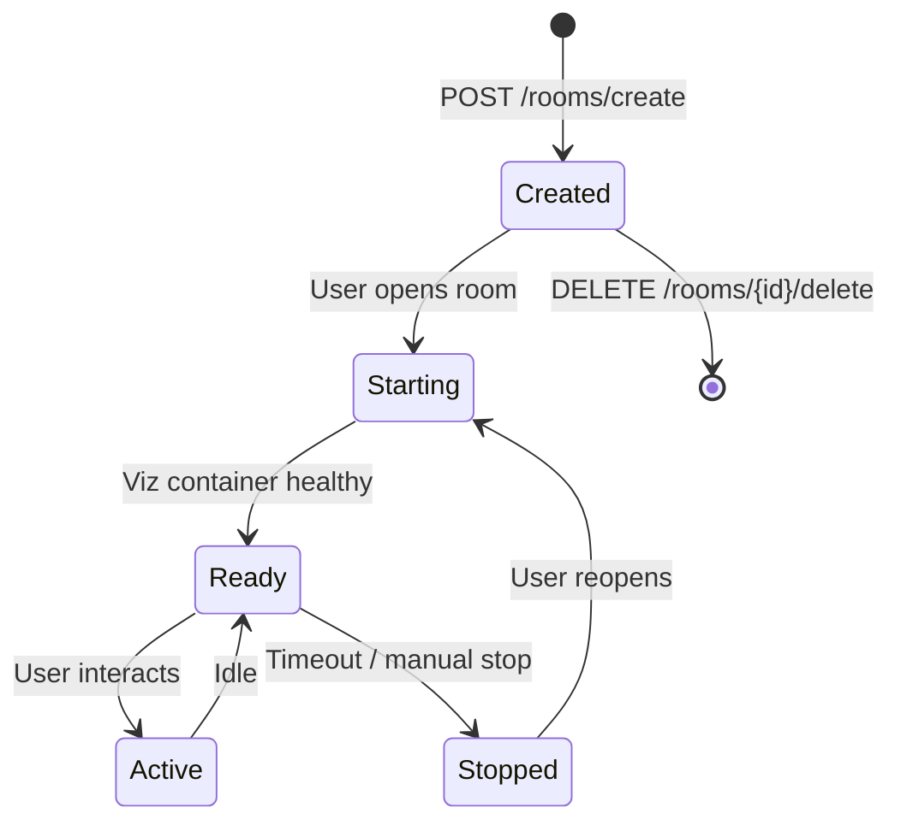

# Room Management

Rooms are the central collaboration unit. Each room has an owner, optional members, a chat history, linked data files, and a dedicated viz container.

## Room lifecycle

## Viz container pool

The room pool manager handles viz container lifecycle:

### Local (Docker)

`docker_pool_manager.py` — Uses Docker API to:

1. Find or create a container from the viz image
2. Mount the workspace filesystem
3. Assign dynamic ports
4. Health-check until ready
5. Clean up on room delete or timeout

### Staging / Production (K8s)

`pool_manager.py` — Creates pods in the `viz-service` namespace:

1. Create pod spec with workspace PVC mount
2. Create service for port exposure
3. Wait for pod readiness
4. Update room record with host/port
5. Delete pod on room cleanup

## Room types

| Type | Description |
|------|-------------|
| `CHAT` | Standard room with AI chat and single visualization |
| `DASHBOARD` | Multi-panel room with layout grid |

## Dashboard panels

Dashboard rooms contain multiple panels, each backed by its own workspace subdirectory. Panels share the room's data files via symlinks.

See [Dashboard Panels](../architecture/workspace.md) for filesystem layout.
