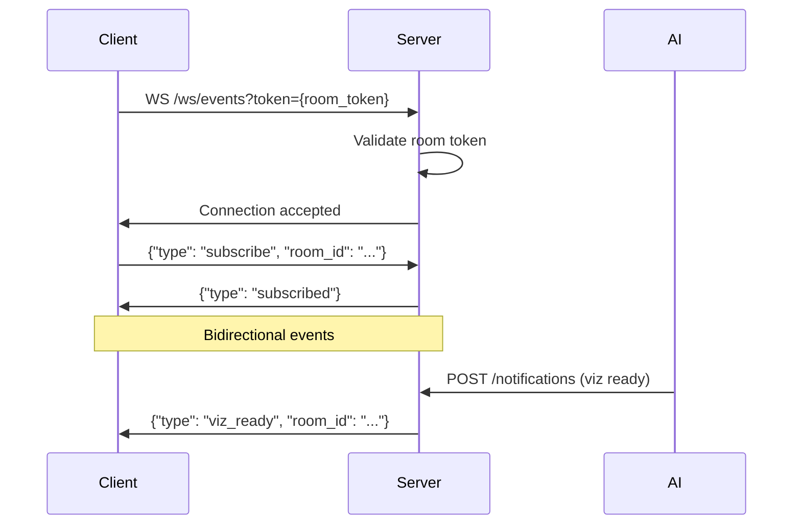

# WebSocket

The server maintains a WebSocket hub at `/ws/events` for real-time communication between the frontend and backend services.

## Connection flow

## Event types

### Client → Server

| Type | Payload | Description |
|------|---------|-------------|
| `subscribe` | `{room_id}` | Subscribe to room events |
| `unsubscribe` | `{room_id}` | Unsubscribe from room |

### Server → Client

| Type | Payload | Description |
|------|---------|-------------|
| `message` | `{room_id, user_id, text}` | New chat message |
| `viz_ready` | `{room_id}` | Viz container is ready |
| `viz_error` | `{room_id, error}` | Viz container error |
| `viz_stopped` | `{room_id}` | Viz container stopped |
| `file_reupload` | `{room_id, file_id}` | File was re-uploaded, room needs refresh |
| `ai_processing` | `{room_id, status}` | AI workflow status update |

## WebSocket Manager

`websocket_manager.py` manages client subscriptions:

- Clients subscribe to rooms by `room_id`
- Events are broadcast to all clients subscribed to a room
- Handles reconnection and cleanup on disconnect
