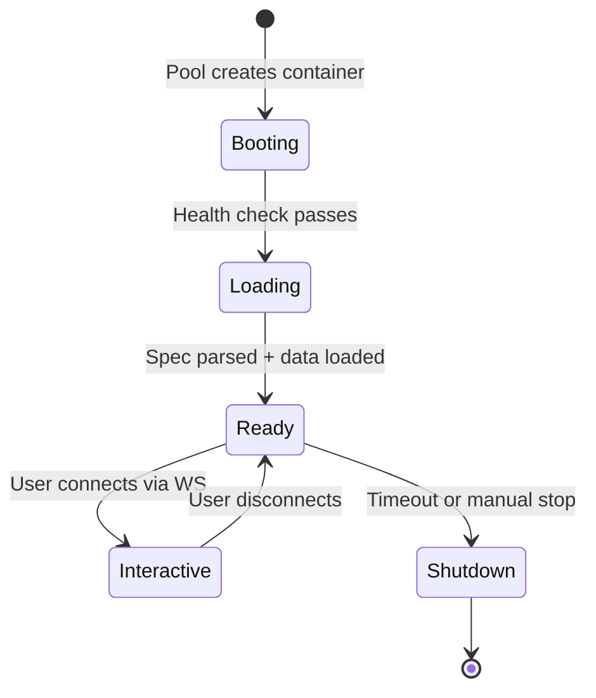

# Viz Service

**Trame-based** — Interactive visualization rendering

The viz service runs as a per-room container, spawned by the room pool manager. It loads visualization specifications, renders them using the appropriate backend, and streams the result to the frontend via Trame's WebSocket protocol.

## Entry point

`viz_service/viz_renderer/` — Trame application.

## Modules

- [Backends](backends.md) — Rendering backends (Plotly, VTK, DeckGL)
- [VizContext](viz-context.md) — Visualization lifecycle state machine

## API Routes

| Method | Path | Description |
|--------|------|-------------|
| GET | `/viz/health` | Container health check |
| POST | `/viz/poweroff` | Graceful shutdown |
| POST | `/viz/send` | Execute command |
| POST | `/viz/reload-kedro` | Restart Kedro Viz server |
| POST | `/viz/refresh_url_sources` | Re-fetch external data |
| POST | `/viz/set_refresh_interval` | Auto-refresh cadence |
| WebSocket | `/viz/app/ws` | Trame protocol |

## Container lifecycle

Each container:

1. Mounts the room workspace filesystem
2. Parses `specifications.xml` via DIVE
3. Loads data files into VizFrames
4. Renders using the detected backend
5. Streams updates via Trame WebSocket
