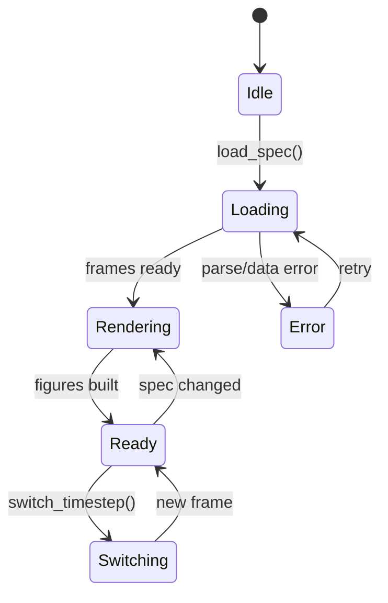

# VizContext

`viz_renderer/viz_context.py` — State machine managing the visualization lifecycle within a Trame container.

## States



## Responsibilities

- **Spec management**: Load/reload `specifications.xml`, track spec version
- **Frame lifecycle**: Parse spec → VizLoader → VizFrames → figures
- **Timestep switching**: For temporal visualizations, switch frames without re-parsing
- **Backend dispatch**: Route frames to the correct rendering backend
- **Error recovery**: Handle parse errors, missing data, backend failures

## Key methods

```python
load_spec(spec_path) -> None
```
Parse the VisuSpec, load data, build frames, render figures.

```python
refresh() -> None
```
Reload spec from disk and re-render (used after AI generates new spec).

```python
switch_timestep(value) -> None
```
Switch to a different timestep and update the rendered figure.

```python
get_timeline_info() -> dict | None
```
Return timeline metadata (count, values, labels, source type).

## Integration with NveilViewer

`nveil_viewer.py` is the Trame application class that:

1. Creates the `VizContext`
2. Handles incoming commands from the server via `/viz/send`
3. Manages the Trame UI layout
4. Dispatches user interactions to the context
