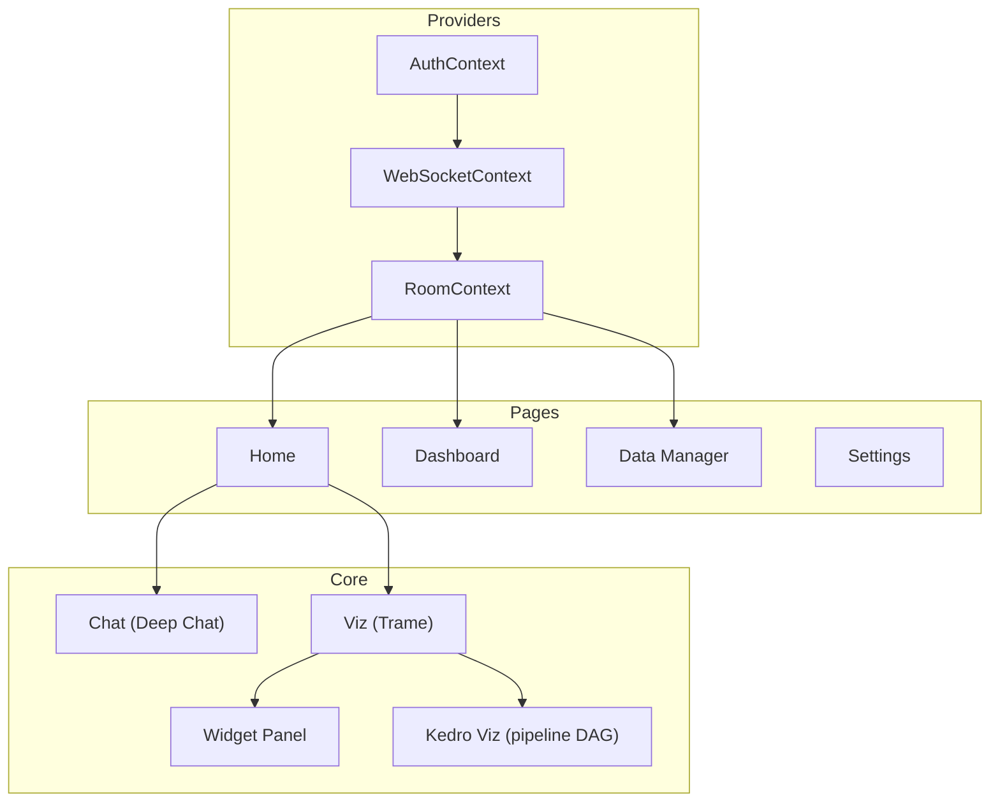

# Architecture

The frontend is organized by feature (one directory per page/domain), with shared state managed through React Context providers.

- [Routing](routing.md) — Routes, lazy loading, code splitting
- [State Management](state.md) — Context providers (Auth, Room, WebSocket)
- [API Layer](api.md) — Backend communication, CSRF, token refresh
- [Internationalization](i18n.md) — i18next setup, translations
