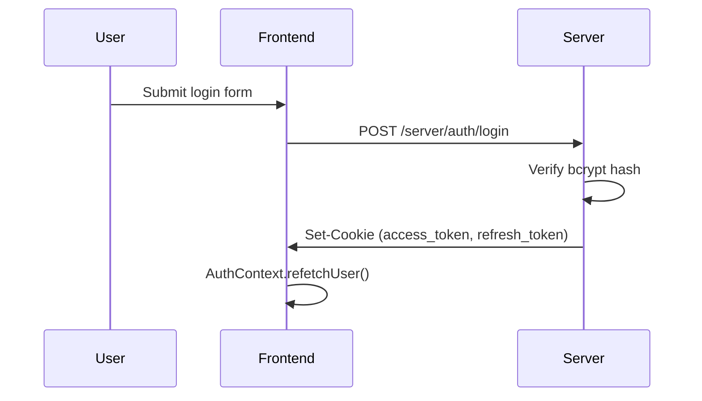
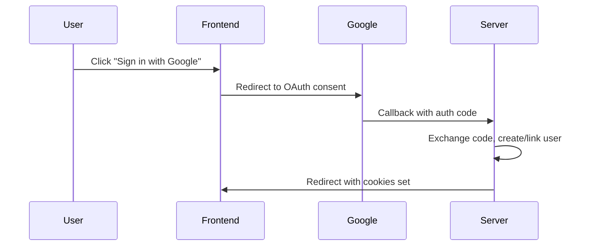

# Authentication

`Auth/` — Login, signup, OAuth, password reset, and guest mode.

## Components

| Component | Description |
|-----------|-------------|
| `Auth.jsx` | Modal wrapper (shown when `showAuthModal` is true) |
| `AuthForms.jsx` | Login, signup, password reset form switching |
| `AuthContext.jsx` | Session management, token refresh, secure requests |

## Auth flows

### Email/password

### OAuth2 (Google, GitHub)

### Guest mode

- No authentication required
- Limited functionality (single room, no persistence)
- `isGuest` flag in AuthContext
- Guest stays at `/` (no room token in URL)

### Password reset

1. `POST /server/auth/forgot-password` — sends email with reset token
2. User clicks link in email
3. `POST /server/auth/reset-password` — sets new password

## Profile completion

After signup, `profileComplete` tracks whether the user has filled required fields (country, profession). If incomplete, a profile modal is shown.
