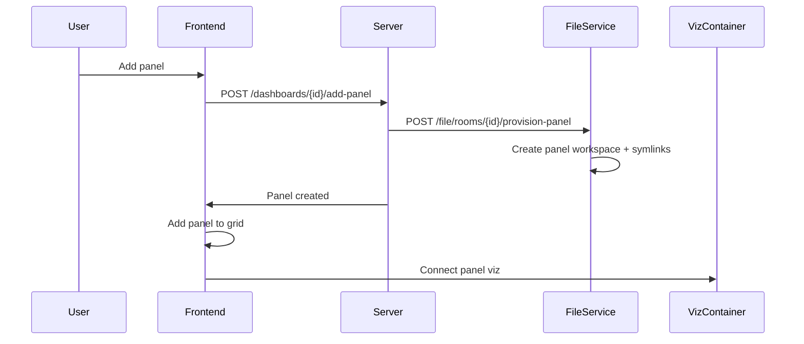

# Dashboard

Dashboard management with grid-based panel layout.

## Dashboard List

`Dashboard/DashboardList.jsx` — Gallery view of user's dashboards.

- Create new dashboard
- Delete existing dashboard
- Navigate to dashboard view

## Dashboard View

`Dashboard/DashboardView.jsx` — Grid layout with multiple visualization panels.

### Features

- **Grid layout**: `react-grid-layout` for drag-and-drop panel arrangement
- **Per-panel viz**: Each panel is a separate viz container
- **Panel provisioning**: Adding a panel triggers file service to set up workspace
- **Layout persistence**: Grid positions saved via `PUT /dashboards/{id}/layout`

### Panel lifecycle

