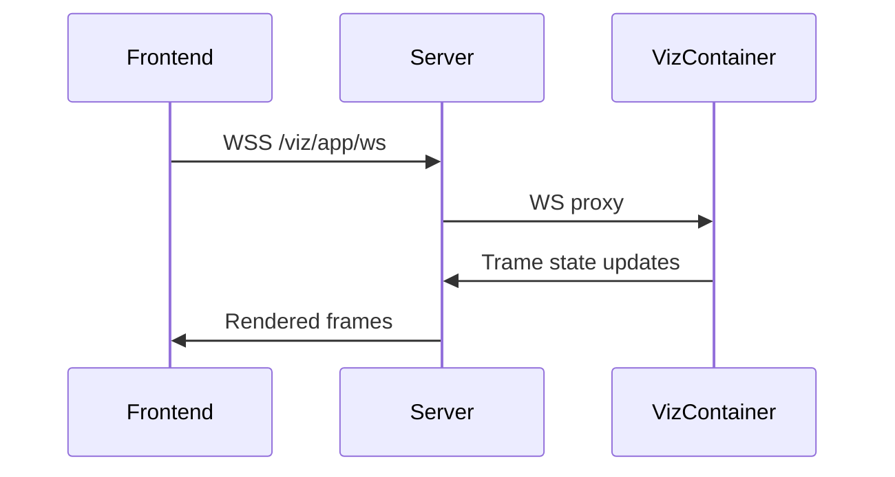
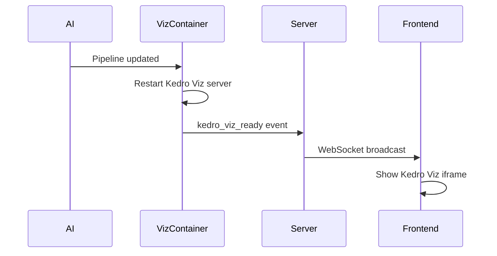

# Visualization

`Viz/Viz.jsx` — Interactive visualization rendering via Trame.

## Architecture

The viz page has two rendering modes: **Trame** for interactive visualizations and **Kedro Viz** for pipeline inspection. Both are embedded as iframes proxied through the server.

### Trame (Visualization)

The viz component embeds a Trame application running in the backend viz container. Communication flows through a WebSocket proxy:

### Kedro Viz (Pipeline Inspection)

Kedro Viz is embedded as an iframe at `/kedro-viz/`, proxied through the server to the viz container. It provides an interactive DAG view of the Choregraph data pipeline.

- **Readiness**: Signaled via a `kedro_viz_ready` WebSocket event, with a polling fallback
- **Styles**: Customized via `kedro.styles.min.css` and `kedro.custom.css`
- **Reload**: Triggered via `POST /viz/reload-kedro` when the pipeline changes
- **Lifecycle**: Kedro Viz starts inside the viz container alongside Trame; when the pipeline is re-run, the server triggers a reload

## Widget Panel

`Viz/widgets/WidgetPanel.jsx` — Dynamic controls generated from backend metadata.

### Available controls

| Control | Component | Description |
|---------|-----------|-------------|
| Slider | `SliderControl` | Range input (numeric channels) |
| Select | `SelectControl` | Dropdown selector (categories) |
| Switch | `SwitchControl` | Toggle (boolean options) |
| Timeline | `TimelineControl` | Timestep scrubber (animation) |
| Sparkline | `SparklinePreview` | Mini chart preview |
| Info | `InfoPanel` | Metadata display |

### Widget rendering

`WidgetRenderer.jsx` dispatches to the correct control component based on widget type metadata received from the backend.

## Export

`ExportDialog` allows exporting the current visualization:

- **Formats**: PNG, JPEG, SVG, PDF, HTML
- **Themes**: Light or dark background
- **Triggered via**: `/viz/send` command to backend

## Backend detection

The viz component adapts its behavior based on the active rendering backend:

| Backend | Interaction mode |
|---------|-----------------|
| Plotly | Native Plotly.js interactivity (zoom, pan, hover) |
| VTK | Trame 3D interaction (rotate, zoom) |
| DeckGL | Map interaction (pan, zoom, tilt) |
